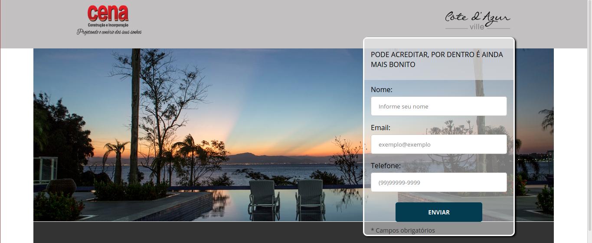
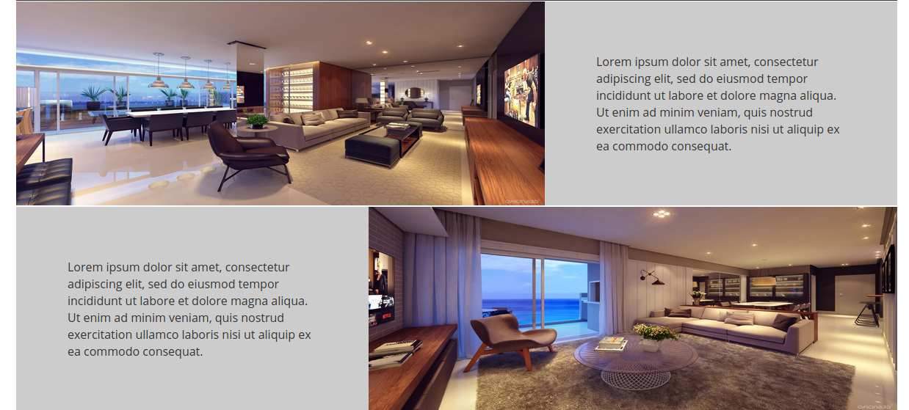

# **Apresentação:**

---

---

 

## :notebook_with_decorative_cover: **Sobre:**

Este é um dos varios projetos práticos que irei fazer durante o curso Full-Stack da ***[Danki-Code](https://cursos.dankicode.com/)***.
 
 
O objetivo deste projeto é fazer uma landing-page totalmente responsiva, com HTML e CSS.
 
 
Um projeto para fixar conhecimentos e conceitos de Web-Design e desenvolvimento Front-End. Não farei o Back-End neste projeto.

---

 

## :computer: **Tecnologias utilizadas:**

- HTML5
- CSS3

---